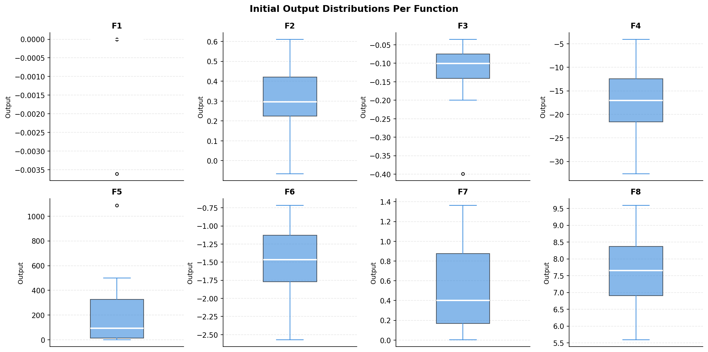
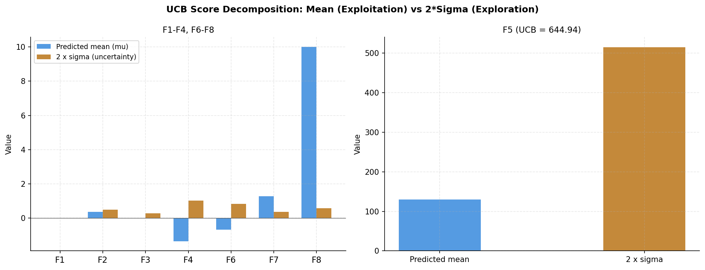
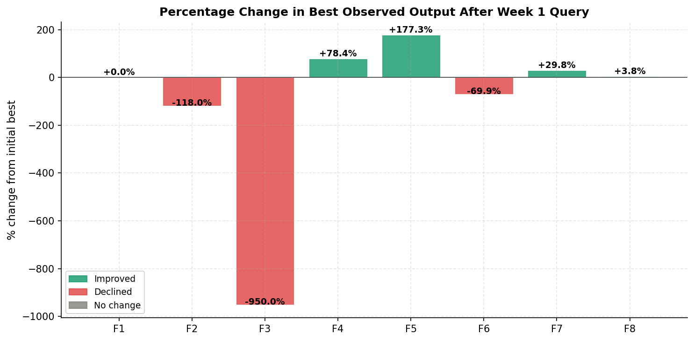
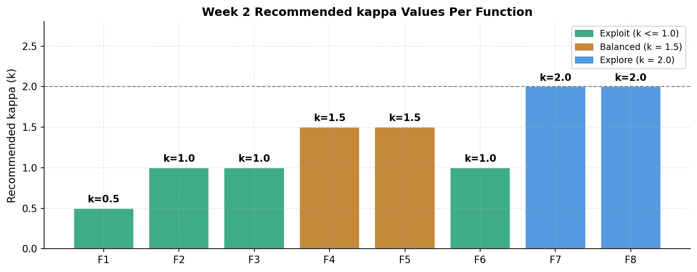

# Week 1: Initial Strategy and First Results

[Back to README](../README.md)

---

## Objective

Submit one query per function based only on the initial datasets provided, using a uniform Bayesian Optimisation strategy as a baseline.

## Dataset Summary

| Function | Dimensions | Initial observations |
|---|---|---|
| F1 | 2 | 10 |
| F2 | 2 | 10 |
| F3 | 3 | 15 |
| F4 | 4 | 30 |
| F5 | 4 | 20 |
| F6 | 5 | 20 |
| F7 | 6 | 30 |
| F8 | 8 | 40 |

All inputs are normalised to the range [0, 1] per dimension. All tasks are treated as maximisation problems.

## Method

A single Gaussian Process surrogate (`ConstantKernel x RBF + WhiteKernel`) was fitted per function, with Upper Confidence Bound used as the acquisition function at a uniform setting (kappa = 2.0) across all eight functions. Candidate points were drawn uniformly at random across the full [0, 1] input space, with no constraints applied.

## Results

| Function | Initial best | Week 1 result | Change |
|---|---|---|---|
| F1 | ~0.000000 | ~0.000000 | No change |
| F2 | 0.611205 | -0.109704 | Declined |
| F3 | -0.034835 | -0.365767 | Declined |
| F4 | -4.025542 | -0.869002 | Improved |
| F5 | 1088.860 | 3019.660 | Improved (+177%) |
| F6 | -0.714265 | -1.213319 | Declined |
| F7 | 1.364968 | 1.771970 | Improved (+30%) |
| F8 | 9.598482 | 9.965293 | Improved (+3.8%) |

## What This Revealed

Five of eight functions either declined or returned a near-zero result. The common pattern across F1, F2, F3, and F6 was that the uniform kappa of 2.0 sent the query toward an uncertain boundary region rather than a region with any prior evidence of being good. F4, F5, F7, and F8 all improved, and in each case the query happened to land closer to an already-promising area of the input space.

This was the clearest early signal that a single, uniform setting was not appropriate across all eight functions, and that future weeks would need function-specific tuning.

## Carried Into Week 2

- Move from a uniform kappa to per-function values, set according to how each function performed in Week 1.
- Apply constrained search boxes for functions that declined, to prevent the same drift toward unhelpful boundary regions.

[Next: Week 2](week2.md)
