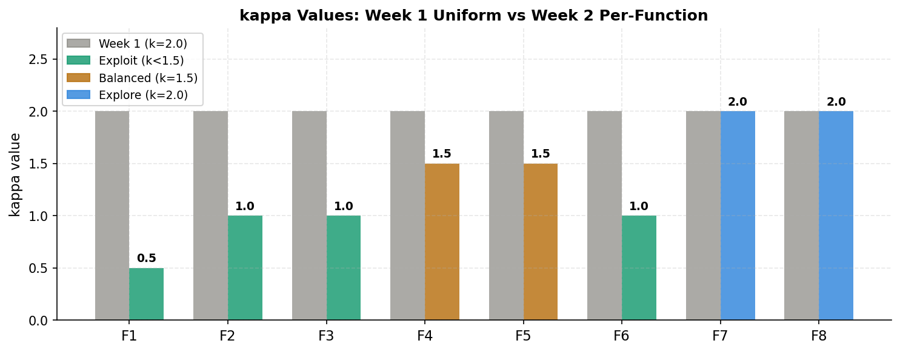
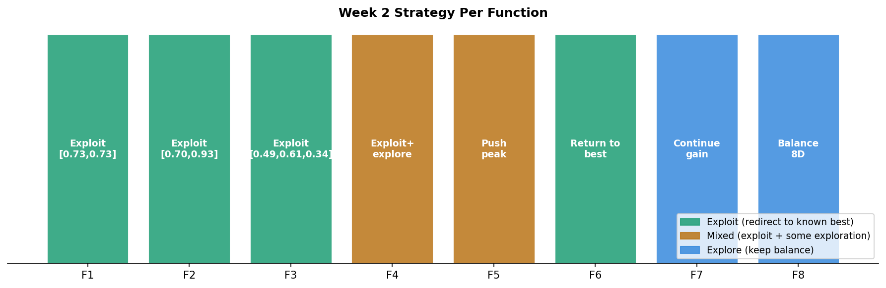
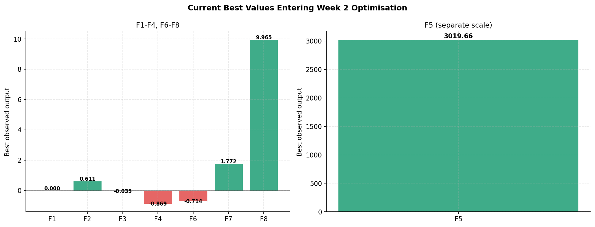
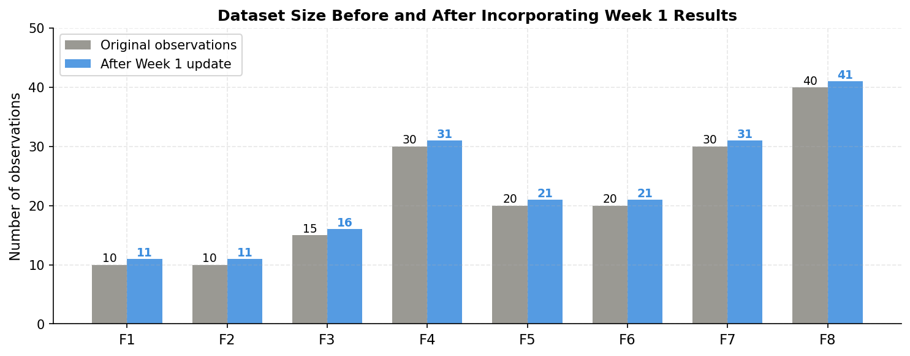

# Week 2: Per-Function Tuning and Constrained Search

[Back to README](../README.md)  |  [Previous: Week 1](week1.md)

---

## Objective

Move from the uniform Week 1 strategy to a per-function approach, using the first week's results to decide how much each function should explore versus exploit.

## What Changed From Week 1

| Area | Week 1 | Week 2 |
|---|---|---|
| Kappa | Uniform 2.0 for all functions | Set individually per function, from 0.5 to 2.0 |
| Search space | Full [0, 1] for every candidate | Constrained boxes applied to five functions |
| Candidate generation | Uniform random | Sobol quasi-random sequences for better coverage |

## Per-Function Reasoning

Functions that declined or returned no signal in Week 1 (F1, F2, F3, F6) were shifted toward exploitation with lower kappa values and constrained search boxes around their best known input. Functions that improved (F4, F5, F7, F8) were either kept at a similar setting or given a moderate kappa to allow continued refinement without discarding what was already working.

## Results

| Function | Best before Week 2 | Week 2 result | Outcome |
|---|---|---|---|
| F1 | ~0.000000 | ~0.000000 | No gain |
| F2 | 0.611205 | 0.145036 | Below initial best, but above Week 1 |
| F3 | -0.034835 | -0.119447 | Declined |
| F4 | -0.869002 | 0.533858 | Crossed from negative to positive |
| F5 | 3019.660 | 3511.612 | Improved (+16%) |
| F6 | -0.714265 | -0.800600 | Declined |
| F7 | 1.771970 | 1.288847 | Declined |
| F8 | 9.965293 | 9.816873 | Declined slightly |

## Reflection: Exploration Versus Exploitation

The overall shift in Week 2 was toward exploitation, but not applied uniformly. Functions with no prior evidence of a good region (F1, F3, F6) were given the lowest kappa values to force the Gaussian Process to commit to its best guess rather than continuing to explore. Functions with a confirmed improving trend (F4, F5) were given a moderate kappa to allow some continued refinement around the emerging good region.

F4's result was the most significant outcome of the week, moving from a negative output to a positive one for the first time. F5 continued its strong run from Week 1. F7 and F8, both of which had improved in Week 1, declined slightly in Week 2, which became an important signal for how those two functions were treated in later weeks.

## Issues Encountered

A practical issue arose with notebook structure: relying on in-place dictionary updates for corrected query values caused inconsistent results when cells were re-run out of order. The fix adopted from this point onward was to use separate, clearly named variables for any corrected or overridden query, rather than writing back into the same dictionary used by the main pipeline.

## Carried Into Week 3

- Investigate whether a single acquisition method is appropriate for every function, given that F7 and F8 both declined despite earlier success.
- Continue tightening constrained boxes for functions with confirmed good regions.

[Next: Week 3](week3.md)
