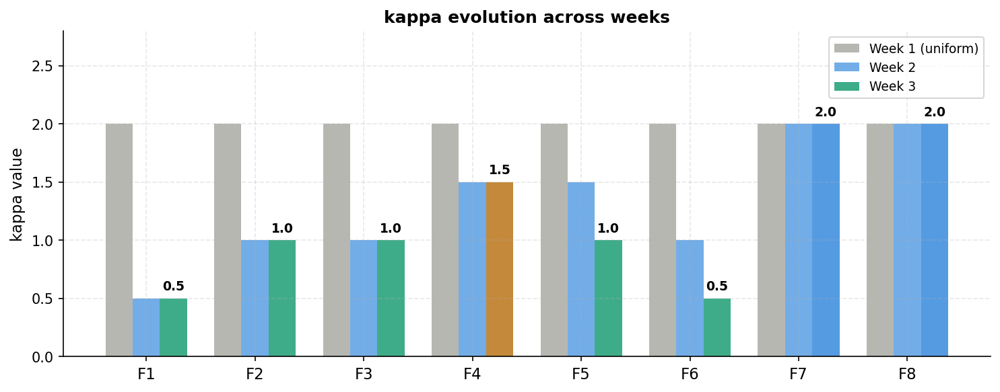
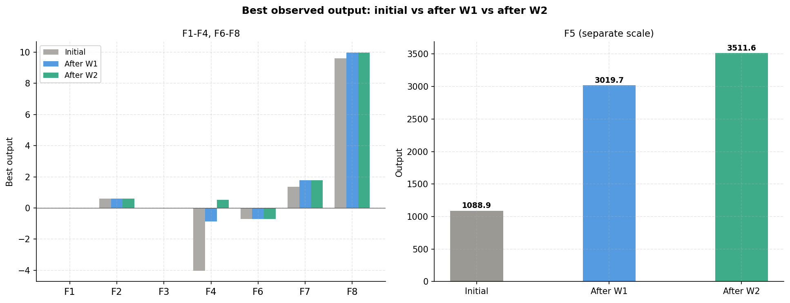
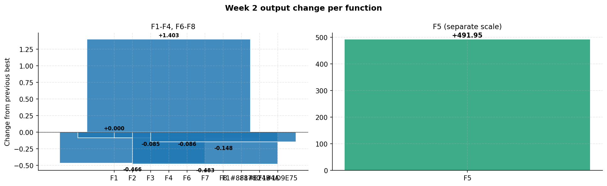

# Week 3: Multiple Acquisition Methods

[Back to README](../README.md)  |  [Previous: Week 2](week2.md)

---

## Objective

Move away from a single acquisition method applied to every function, and instead match each function to the method best suited to its observed behaviour across the first two weeks.

## Method Assignment

| Function | Method used | Reasoning |
|---|---|---|
| F1 | Expected Improvement | UCB had repeatedly drifted from the known best input; EI only queries where genuine improvement is expected |
| F2 | Expected Improvement | Same reasoning as F1; confirmed peak region needed precise targeting |
| F3 | Upper Confidence Bound (tight) | Interior optimum confirmed; needed bounds rather than a different method |
| F4 | Upper Confidence Bound | New positive best from Week 2; exploiting the immediate neighbourhood |
| F5 | Upper Confidence Bound (fine-tune) | Three weeks of gains; lower kappa for precision |
| F6 | Deterministic grid search | Gaussian Process had proven unreliable on this function across two weeks |
| F7 | Thompson Sampling | Declined under high-kappa UCB in Week 2; posterior sampling tested as an alternative |
| F8 | Thompson Sampling | Same reasoning as F7 |

## Results

| Function | Best before Week 3 | Week 3 result | Outcome |
|---|---|---|---|
| F1 | ~0.000000 | ~0.000000 | No gain |
| F2 | 0.611205 | 0.091682 | Below best |
| F3 | -0.034835 | -0.021428 | First gain |
| F4 | 0.533858 | 0.231372 | Below best |
| F5 | 3511.612 | 3214.793 | Declined |
| F6 | -0.714265 | -0.703638 | First gain |
| F7 | 1.771970 | 1.919249 | New best |
| F8 | 9.965293 | 9.617217 | Declined |

## What Worked

F3 and F6 both recorded their first improvement over the original dataset after two weeks of decline. F3's gain came from finally placing a query in the interior of the input space rather than at a boundary corner, which had failed twice before. F6's gain came from abandoning the Gaussian Process entirely in favour of a small, deterministic grid search centred on the best known input, since the surrogate had been producing unreliable predictions on this function.

F7 set a new all-time best using Thompson Sampling, confirming that the region identified in Week 1 was genuinely productive once explored with posterior sampling rather than a fixed-kappa UCB.

## What Did Not Work

F5 declined for the first time after two consecutive gains. The cause was traced to one specific input dimension dropping below the range that had previously produced strong results. This became the basis for a constraint fix applied in the following week.

F8's broad exploration under Thompson Sampling moved into a region with no prior evidence of being good, and returned a worse result. This was a deliberate, informative attempt at finding a better global region, but it did not succeed.

## Carried Into Week 4

- Fix the specific dimension constraint responsible for F5's decline.
- Reassess whether Thompson Sampling remains appropriate for F7 and F8, given mixed results.

[Next: Week 4](week4.md)
