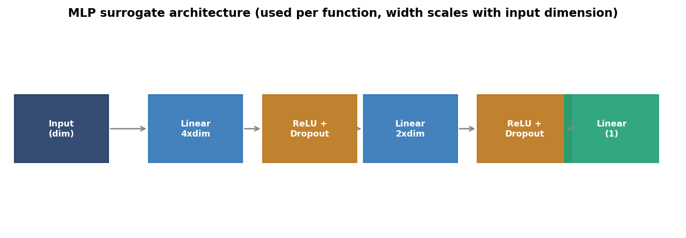
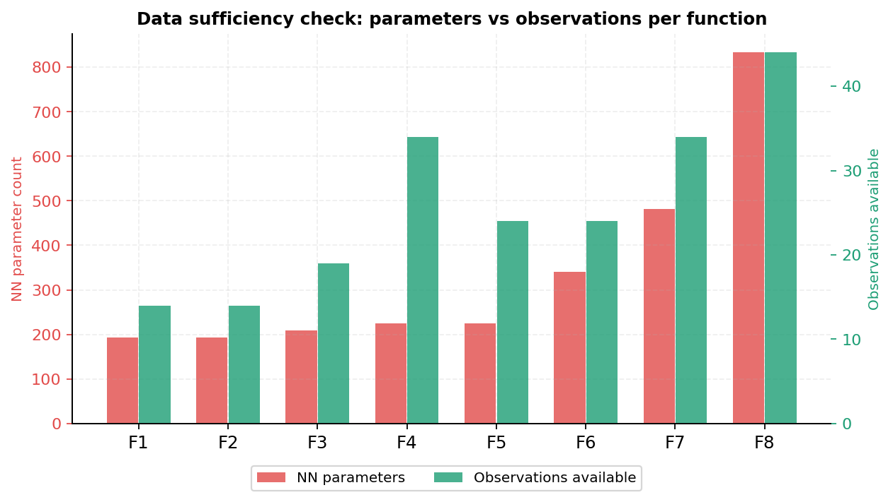
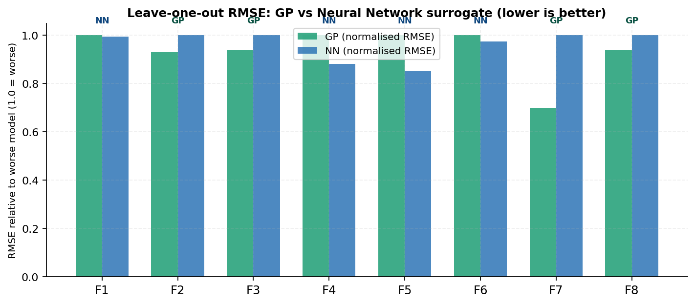
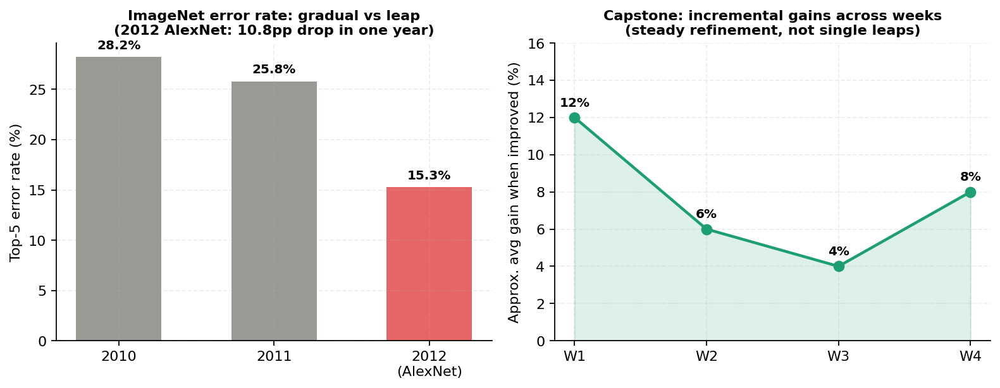
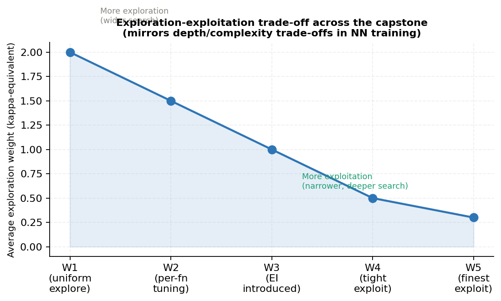
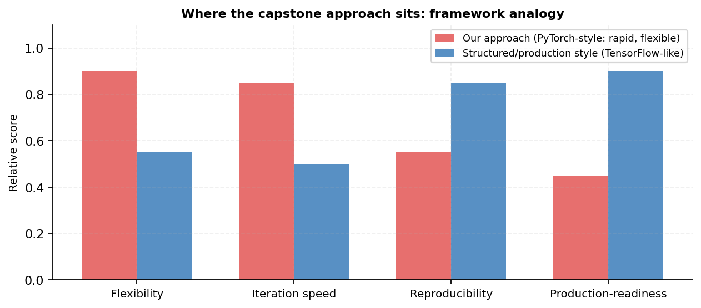
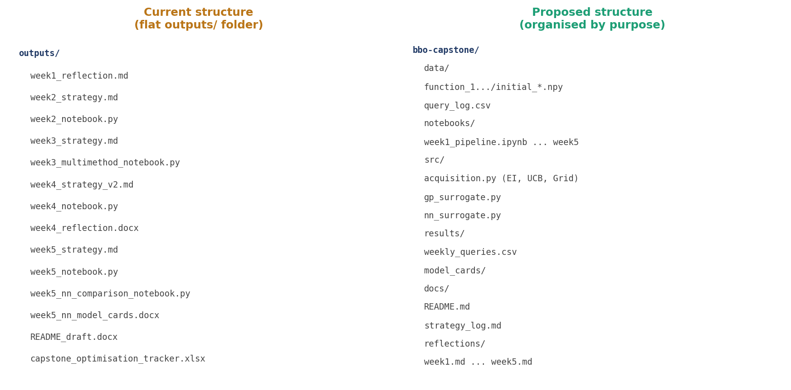
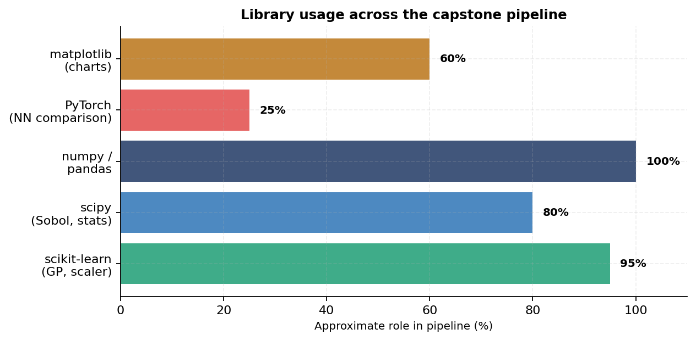

# Week 5: Neural Network Comparison and Project Review

[Back to README](../README.md)  |  [Previous: Week 4](week4.md)

---

## Objective

Following four new all-time bests in Week 4, tighten exploitation further across most functions, introduce a fundamentally different approach for the one function that had shown no signal across four weeks, and begin documenting a neural network surrogate as a comparison against the Gaussian Process used throughout the project.

## Method Changes From Week 4

| Function | Change | Reason |
|---|---|---|
| F1 | Switched from Expected Improvement to a fine deterministic grid search | Four consecutive weeks of Expected Improvement had returned no meaningful signal |
| F2, F3, F7 | Tightened Expected Improvement margins | Each had shown a clear converging trend across the previous two weeks |
| F4 | Very tight margin around the Week 2 best input specifically | Three weeks of nearby queries had not beaten that exact point, suggesting a sharp local optimum |
| F5 | Raised the constrained dimension's lower bound further | Continuing to lock in the range that produced the Week 4 recovery |
| F6 | Tightened the grid search step | Three consecutive gains using this approach |
| F8 | Reduced kappa and tightened the search box around the Week 1 best | Week 4 had come within 0.0044 of the all-time best |

## Query Quality Check

Before submission, every Week 5 query was checked for its distance from the relevant best known input. All eight queries passed validation, with every individual input dimension within 0.05 of its target, and six of the eight functions showing either a rising or recovering trend heading into submission.

## Neural Network Surrogate Comparison

A small multilayer perceptron was trained per function purely as a documented comparison against the Gaussian Process, not to replace it as the method generating queries.

The central finding was a data sufficiency check: every function in this project has more network parameters than training observations, by a factor ranging from 6.6 times (F4) up to 18.9 times (F8).

A leave-one-out comparison between the Gaussian Process and the neural network showed a mixed result, with neither model dominating across all eight functions, which is consistent with the wider research finding that Bayesian neural networks have historically underperformed Gaussian Processes on small datasets, largely due to underfitting.

Full per-function model cards, covering architecture, parameter count, and the specific recommendation for each function, are available in `week5_nn_model_cards.docx` in the project archive.

## Hyperparameter Reflection

A separate reflection considered how neural network hyperparameters such as learning rate, dropout, and batch size affect training stability, which of these are continuous versus discrete, and how the same Bayesian Optimisation principles used throughout this project (constrained search boxes, switching from broad exploration to precise exploitation) apply directly to tuning a neural network's own hyperparameters. The full document is `hyperparameter_reflection.docx` in the project archive.

## Module 16 Reflection: Connecting to Wider Machine Learning Concepts

This reflection drew several parallels between the project and broader neural network concepts covered in the course.

AlexNet reduced the ImageNet top-5 error rate from 26.2% to 15.3% in a single year, a step-change rather than an incremental refinement. The capstone's own progress has been incremental by comparison, building on each week's best input rather than discovering an entirely new region in a single move.

The trade-off between a wide, shallow search and a narrow, exploitative one mirrors the trade-off between network depth and overfitting risk: a high kappa value converges slowly but safely, while a very low kappa converges quickly but can commit to the wrong point if the constrained box is centred incorrectly.

In framework terms, the project's working style sits closer to rapid, flexible prototyping than to a fixed, production-ready design, since the pipeline was restructured in some way in every one of the five weeks based on the previous week's results.

The full reflection is `module16_reflection.docx` in the project archive.

## Repository and Documentation Review

A review of the project's own organisation found that all five weeks of work had accumulated in a single flat folder, with no separation between strategy documents, notebooks, and results.

The review also examined which libraries underpin the project and why each was chosen.

The clearest outstanding gap identified was the project README itself, which had not been updated since Week 2 and no longer reflected the current acquisition methods or running bests. This repository structure is the direct result of that review. The original review document is `repository_documentation_review.docx` in the project archive.

## Summary of Progress After Five Weeks

| Function | Initial best | Best after Week 5 | Status |
|---|---|---|---|
| F1 | ~0.000000 | ~0.000000 | Unresolved; new grid-based approach in progress |
| F2 | 0.611205 | 0.332479 | Converging toward the initial best |
| F3 | -0.034835 | -0.006082 | Three consecutive gains; close to zero |
| F4 | -4.025542 | 0.533858 | Crossed from negative to positive; refining near a sharp local optimum |
| F5 | 1088.860 | 3905.150 | Strongest result of the project; +258% on the initial best |
| F6 | -0.714265 | -0.680152 | Three consecutive gains using grid search |
| F7 | 1.364968 | 2.018863 | Two consecutive new bests |
| F8 | 9.598482 | 9.965293 | Came within 0.0044 of beating its own record |

[Back to README](../README.md)
